### Created by Karla Tolentino
# T1A2 - Portfolio  

## Table of Contents
- [Portfolio Website](#portfolio-website)
- [GitHub Repository](#github-repository)
- [Purpose](#purpose)
- [Functionality and Features](#functionality-and-features)
- [Sitemap](#sitemap)
- [Screenshots](#screenshots)
- [Target Audience](#target-audience)
- [Tech Stack](#tech-stack)
- [Resources](#resources)

## Portfolio Website
https://karlas-portfolio.netlify.app/

## GitHub Repository
https://github.com/karlatolentino/portfolio

## Purpose
The purpose of this assignment is to demonstrate the skills and professional knowledge I have learned as a **Junior Developer** to prospective employers.

By planning, designing and developing an online portfolio website, it will allow me to present my unique personality as an IT professional and budding **dev** with creative and technical control.

## Functionality and Features
* *Index/Home* page featuring my name, main background image, logo and links to pages displayed on a navigation bar.

* *About Me* page detailing personal brand and description as well as detailing developed skills, work/study experience. My resume is linked through a button under skills & experience.

* *Projects* page showcasing placeholder projects in the form of interactive flip cards with images and text.

* *Blog* page with five posts including an image, date stamp and text for each post.

* *Contact* page with contact form, embedded map and footer containing graphics that link to social pages GitHub and LinkedIn.

## Sitemap
Sitemap

## Screenshots
Trello Board

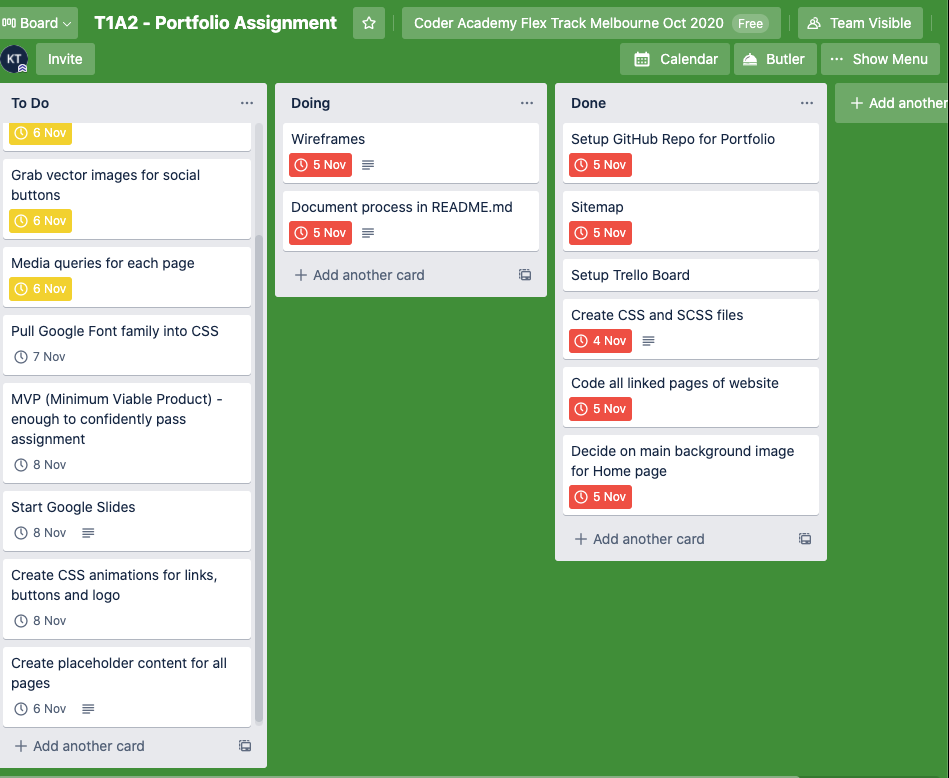

Wireframes

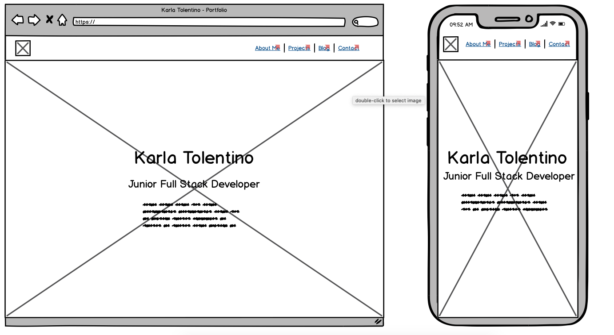
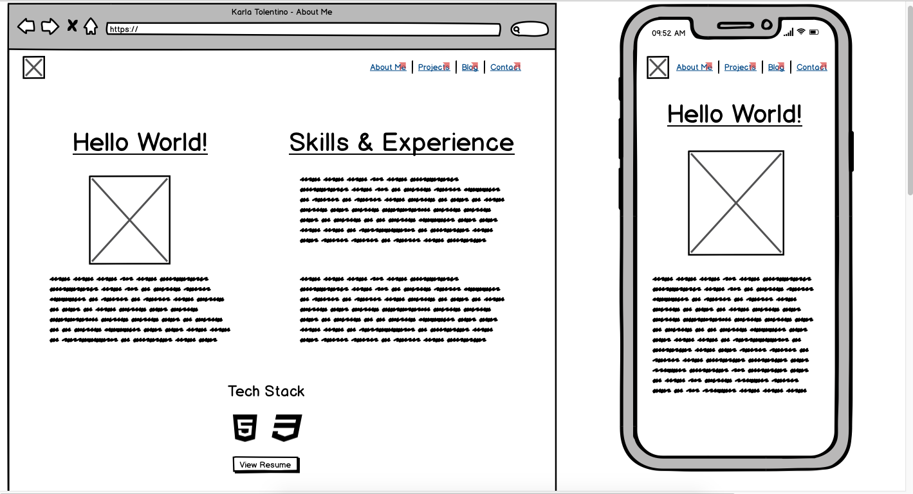
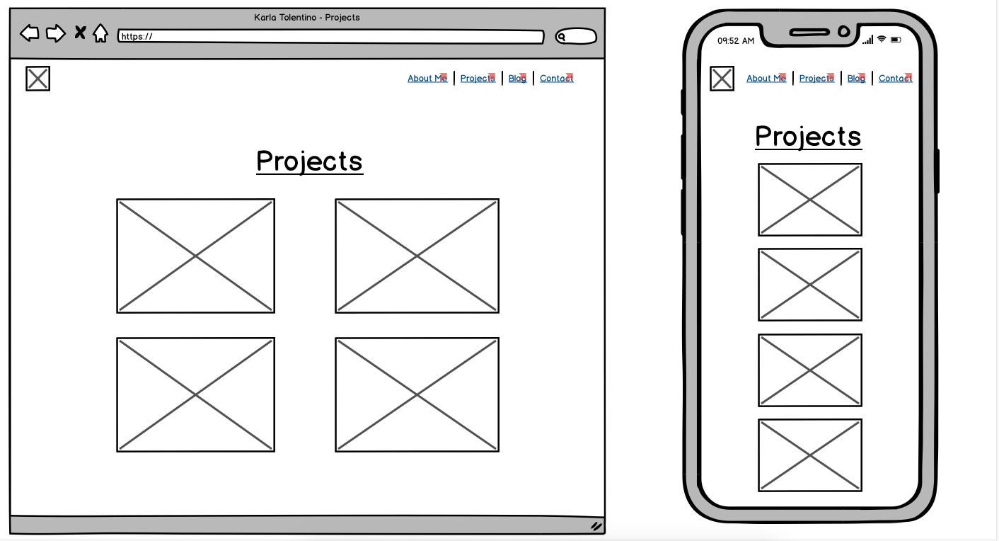
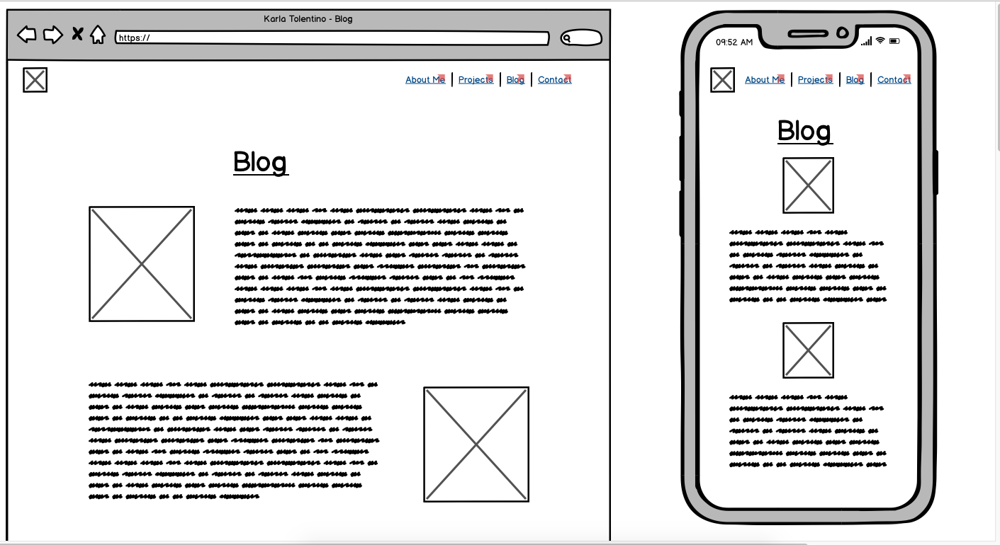
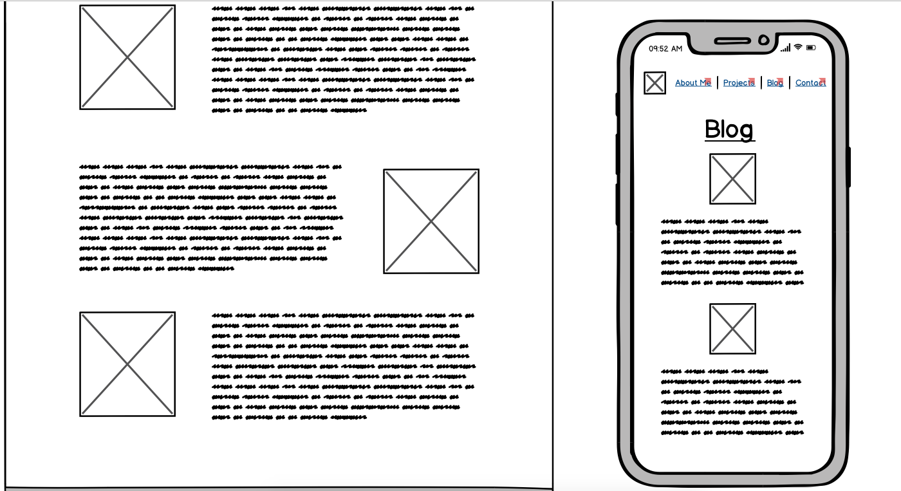
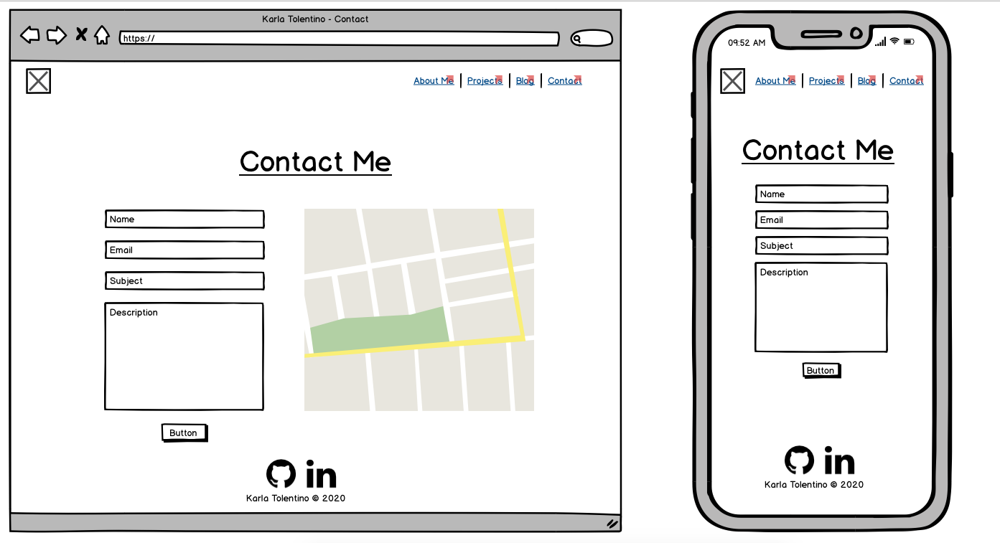
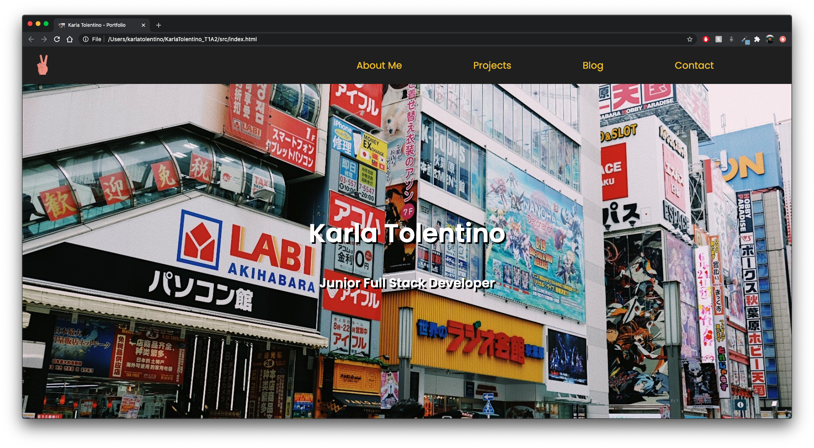
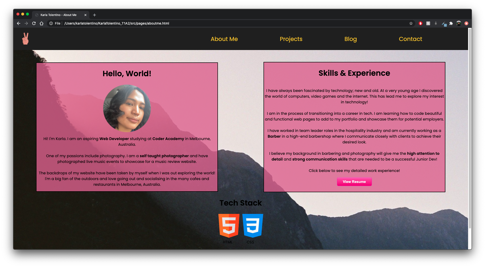
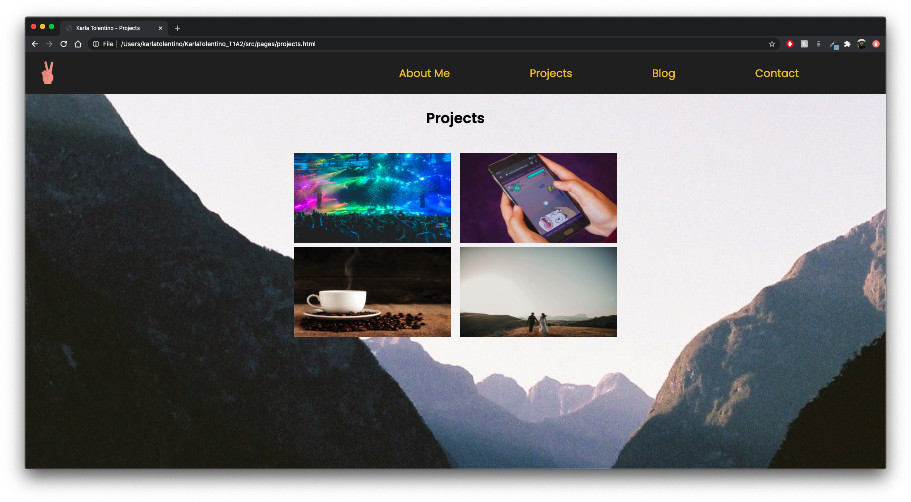
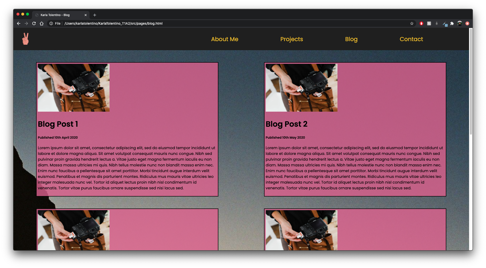
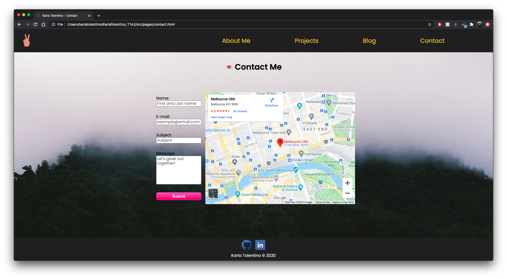

## Target Audience
The target audience for the portfolio website is aimed towards employers looking to engage with a dev and/or IT professional.

## Tech Stack
This online portfolio has been created using only HTML and CSS and deployed using Netlify and linked via GitHub.

## Resources
Index image used
- https://www.flaticon.com/free-icon/peace-sign_3100278?term=peace%20sign&page=1&position=15

Portfolio images used
- https://images.unsplash.com/photo-1586763749650-70d7996310d0?ixlib=rb-1.2.1&ixid=eyJhcHBfaWQiOjEyMDd9&auto=format&fit=crop&w=1050&q=80
- https://images.unsplash.com/photo-1514525253161-7a46d19cd819?ixlib=rb-1.2.1&ixid=eyJhcHBfaWQiOjEyMDd9&auto=format&fit=crop&w=967&q=80
- https://images.unsplash.com/photo-1532712938310-34cb3982ef74?ixlib=rb-1.2.1&ixid=eyJhcHBfaWQiOjEyMDd9&auto=format&fit=crop&w=1050&q=80
- https://images.unsplash.com/photo-1497515114629-f71d768fd07c?ixlib=rb-1.2.1&auto=format&fit=crop&w=1362&q=80

Blog image used
- https://images.unsplash.com/photo-1602524209281-13fa58445e81?ixlib=rb-1.2.1&ixid=eyJhcHBfaWQiOjEyMDd9&auto=format&fit=crop&w=1050&q=80