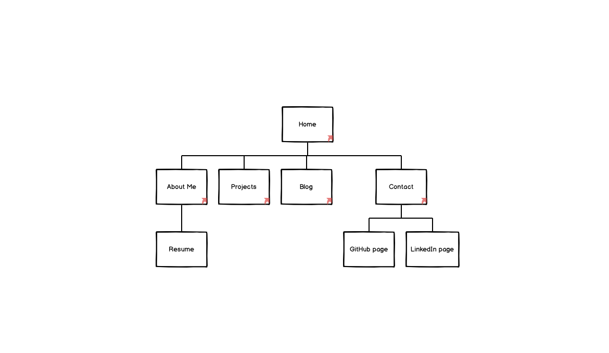

### Created by Karla Tolentino
# T1A2 - Portfolio  

## Table of Contents
- [Portfolio Website](#portfolio-website)
- [GitHub Repository](#github-repository)
- [Purpose](#purpose)
- [Functionality and Features](#functionality-and-features)
- [Sitemap](#sitemap)
- [Screenshots](#screenshots)
- [Target Audience](#target-audience)
- [Tech Stack](#tech-stack)

## Portfolio Website
[Enter link to deployed website on Netlify]

## GitHub Repository
https://github.com/karlatolentino/portfolio

## Purpose
The purpose of this assignment is to demonstrate the skills and professional knowledge I have learned as a **Junior Developer** to prospective employers.

By planning, designing and developing an online portfolio website, it will allow me to present my unique personality as an IT professional and budding **dev** with creative and technical control.

## Functionality and Features
* *Index/Home* page featuring my name, main background image, logo and links to pages displayed on a navigation bar

* *About Me* page detailing personal brand and description as well as detailing developed skills, work/study experience

* *Projects* page showcasing placeholder projects in the form of interactive images and text

* *Blog* page with five posts including an image and date stamp for each post

* *Contact* page with forms for user input enquiries

## Sitemap
Sitemap

## Screenshots
Trello Board

## Target Audience
The target audience for the portfolio website is aimed towards employers looking to engage with a dev and/or IT professional.

## Tech Stack
This online portfolio has been created using only HTML and CSS.
Deployment
GitHub
